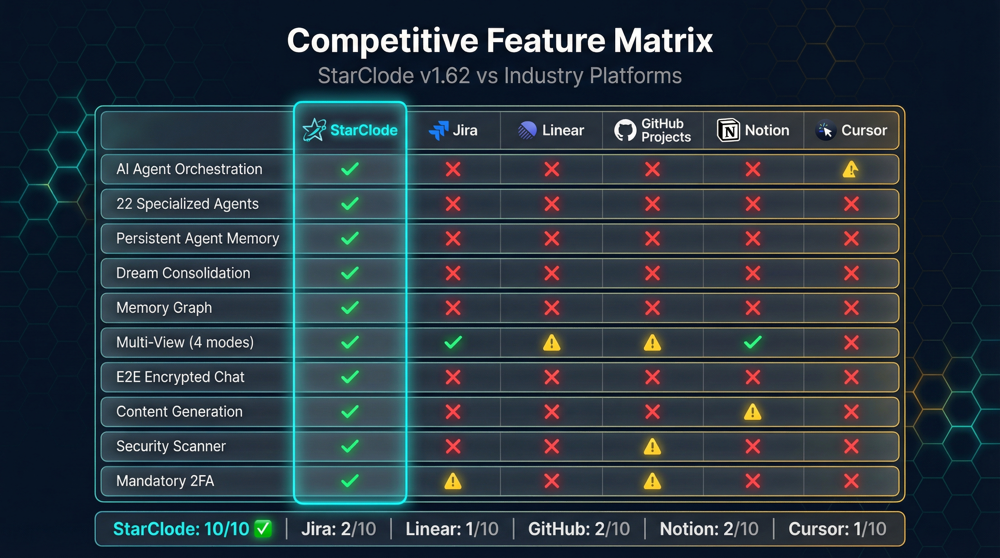
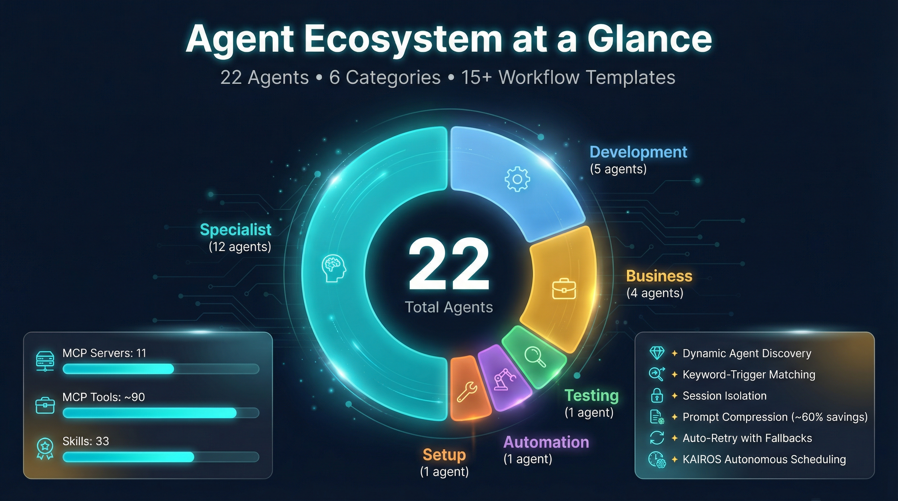
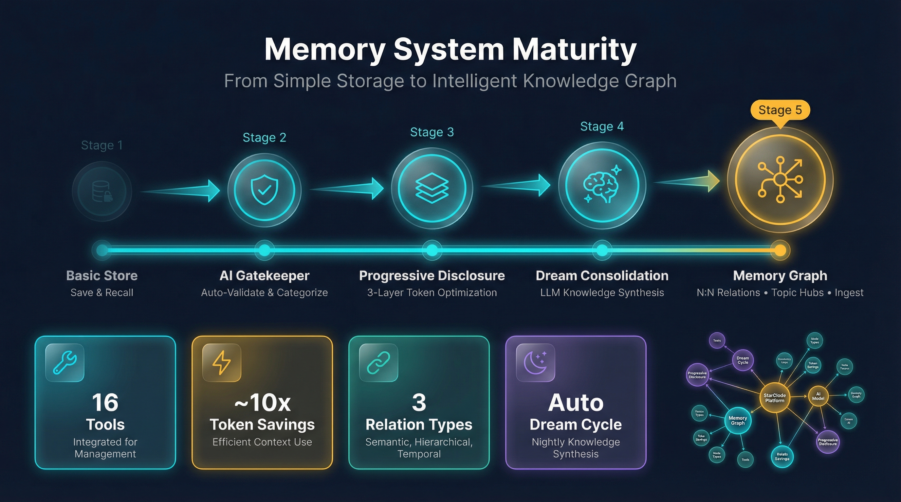
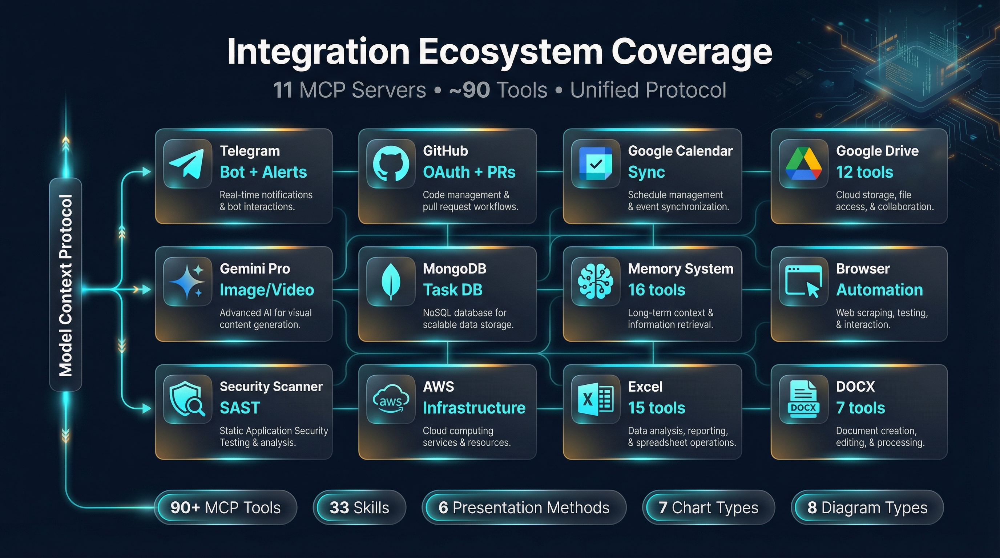

<p align="center">
  
</p>

<h1 align="center">StarClode</h1>

<p align="center">
  <strong>AI-Native Project Management Platform</strong><br>
  <em>Where AI agents are team members, not just tools.</em>
</p>

<p align="center">
  <a href="https://creativecommons.org/licenses/by-nc-nd/4.0/"></a>
  
  
  
  
</p>

---

## What is StarClode?

StarClode is a **production-grade project management platform** that embeds AI agents as first-class participants in the software development lifecycle. Unlike conventional tools that treat AI as a chatbot or suggestion engine, StarClode's agents autonomously receive task assignments, write and test code, generate documents, create presentations, and deliver pull requests — all within a governed, team-oriented environment.

The platform combines **enterprise project management** (sprints, Kanban boards, team collaboration) with a **multi-agent AI execution layer**, **persistent cross-session memory**, and a **self-evolving skill system** — capabilities no single competitor offers together.

> **Audience:** This repository contains public documentation intended for investors, technical partners, and enterprise evaluators.

---

## Repository Contents

| Document | Description |
|----------|-------------|
| [**Technical Paper**](STARCLODE_PAPER_v1.62.md) | Full technical paper — 8,000+ words, 11 sections covering architecture, agents, memory, security, and competitive positioning |
| [**Benchmark Report**](STARCLODE_BENCHMARKS_v1.62.md) | Feature benchmark — 5,700+ words, 10 capability categories with detailed metrics and competitive matrix |
| [**Presentation Deck**](STARCLODE_PAPER_PRESENTATION.pptx) | 21-slide executive presentation deck (PowerPoint) |

---

## Platform Architecture

StarClode is built on a **three-tier architecture** that separates user-facing concerns, business logic, and the AI execution layer into independently scalable components.

<p align="center">
  
</p>

| Layer | Stack | Purpose |
|-------|-------|---------|
| **Frontend** | Next.js 14, React 18, Tailwind CSS, Zustand, SWR | Real-time dashboard, Kanban boards, calendar, agent monitoring |
| **Backend** | NestJS 10, MongoDB Atlas, Redis/Bull, Socket.io | Business logic, queues, WebSocket streaming, scheduled jobs |
| **AI Execution** | Claude Agent SDK, MCP servers, session isolation | Agent orchestration, tool access, autonomous task execution |

---

## AI Agent System

The platform's primary differentiator: a **growing fleet of 20+ specialized agents** organized into 6 categories, coordinated by a single orchestrator through structured handoff protocols.

<p align="center">
  
</p>

### How It Works

```
User assigns task  →  Orchestrator decomposes  →  Specialist agents execute
                                                          ↓
Pull Request  ←  Code committed  ←  Tests pass  ←  Implementation complete
```

### Agent Categories

| Category | Examples | Purpose |
|----------|----------|---------|
| **Development** | Orchestrator, backend, frontend, DevOps, tester | Core software delivery pipeline |
| **Specialist** | Security, web design, documentation, legal compliance | Cross-cutting domain expertise |
| **Business** | Marketing, social media, market analysis | Strategic and market-facing work |
| **Automation** | Browser automation | Web scraping, screenshots, form filling |
| **Domain-Specific** | AWS, blockchain, ICT architecture, compliance | Custom organizational expertise |
| **Content** | Presentations, diagrams, infographics | Professional deliverable creation |

### Key Capabilities

- **Task-to-PR Pipeline** — Fully autonomous from assignment to deliverable, no human intervention required
- **Skill Auto-Generation** — `/skillify` captures successful workflows as reusable one-command skills
- **Skills Auto-Discovery** — Hot-reloads new skill definitions in real time
- **KAIROS Scheduling** — Autonomous cron-based agent deployment with LLM guardrails and Telegram approval
- **Prompt Compression** — ~60% token reduction on continued sessions
- **Session Isolation** — Every agent runs in a unique workspace, preventing cross-session interference

---

## Persistent Memory System

A **cross-session, AI-gated knowledge store** that accumulates institutional knowledge — the longer StarClode operates, the smarter its agents become.

<p align="center">
  
</p>

### Architecture

| Layer | Purpose | Token Cost |
|-------|---------|------------|
| **L1 — Compact Index** | Quick scan of matching memories with relevance scores | Minimal |
| **L2 — Timeline View** | Chronological context with moderate detail | Moderate |
| **L3 — Full Detail** | Complete memory records for selected items | Full |

> **Result:** ~10x token reduction compared to naive full-fetch approaches.

### Features

| Feature | Description |
|---------|-------------|
| **AI Gatekeeper** | Validates every memory before storage — filters ephemeral data, detects scope, extracts keywords, deduplicates |
| **Dream Consolidation** | Nightly automated knowledge synthesis — merges redundant memories, archives stale ones, discovers new relationships |
| **Topic Clustering** | LLM-generated semantic groupings (5-15 per project) for navigable recall |
| **Memory Ingest** | Extracts knowledge from PDFs, DOCX, spreadsheets, JSON, CSV, and web pages |
| **N:N Relations** | Many-to-many typed relationships (updates, extends, derives) forming a traversable knowledge graph |

### Memory Graph — Live Production

The interactive memory graph renders the full knowledge network as a **d3-force directed graph** on HTML5 Canvas:

<p align="center">
  
</p>

> *Real production screenshot showing hundreds of interconnected knowledge nodes accumulated through weeks of agent activity. Blue = facts, amber = decisions, gray = entities. Hub nodes cluster related memories by topic.*

---

## Content Creation Toolkit

Agents produce **professional-quality deliverables** — not just code:

| Domain | Capabilities |
|--------|-------------|
| **Presentations** | 6 creation approaches (HTML→PPTX, template-based, JSON→PPTX, Gemini AI, reveal.js, Pandoc) |
| **Excel/XLSX** | 15 MCP tools + 8 scripts, 7 chart types, conditional formatting, data validation |
| **DOCX** | 7-tool tracked changes workflow — agents co-author in native Word format |
| **Diagrams** | Mermaid.js (8 types) + Draw.io visual editor, inline in task descriptions |
| **Images** | Gemini Pro AI generation up to 4K resolution |
| **Video** | Veo 3.1 video clips, 4-8 seconds, up to 4K |

---

## Integration Ecosystem

**11+ MCP servers** providing **90+ tools** to agents at runtime, plus **30+ reusable skills** that grow through use.

<p align="center">
  
</p>

| MCP Server | Tools | Domain |
|------------|-------|--------|
| memory-mongodb | 16 | Persistent agent memory |
| google-drive | 12 | File management, shared drives |
| excel | 15 | Workbook creation, charts, formatting |
| docx-revision | 7 | Tracked changes, co-authoring |
| security-scanner | 6 | SAST, secrets detection, dependency audit |
| mongodb | ~8 | Database queries and administration |
| gemini-pro | ~6 | AI image/video generation |
| browser-automation | ~8 | Web scraping, screenshots |
| telegram | ~5 | Bot messaging and notifications |

### External Integrations

| Platform | Capabilities |
|----------|-------------|
| **GitHub** | OAuth2, branch creation from tasks, auto PR with descriptions, bulk merge |
| **Google Calendar** | Bidirectional sync — push tasks, pull events |
| **Google Drive** | 12 tools, auto-export Docs/Sheets/Slides |
| **Telegram** | Full interactive bot — commands, callbacks, deadline alerts, KAIROS approvals |
| **Gemini Pro** | Image generation (4K), video clips (Veo 3.1), text-to-speech (30 voices) |

---

## Security

Enterprise-grade security built in at every layer — not bolted on afterward.

| Layer | Standard |
|-------|----------|
| **Authentication** | JWT (15min access / 7day refresh) + **mandatory TOTP 2FA** |
| **Passwords** | bcrypt, 12+ rounds |
| **Tokens at rest** | AES-256-GCM encryption |
| **Messaging** | X25519 + XSalsa20-Poly1305 end-to-end encryption |
| **Key derivation** | PBKDF2 via Web Crypto API — server never holds plaintext keys |
| **Access control** | RBAC: Admin/User (platform) + Editor/Viewer (team), 10+ NestJS guards |
| **Transport** | Helmet headers, strict CORS, rate limiting, input validation |
| **Code scanning** | Integrated SAST scanner — static analysis + secrets detection + dependency audit |

---

## Competitive Positioning

<p align="center">
  
</p>

### StarClode vs. The Market

| Capability | StarClode | Jira | Linear | Claude Code CLI | Cursor | Devin |
|------------|:---------:|:----:|:------:|:---------------:|:------:|:-----:|
| Multi-Agent Orchestration | **20+ agents** | — | — | Single | Single | Single |
| Persistent Memory | **Cross-session** | — | — | Session only | Session only | Limited |
| Skill Auto-Generation | **/skillify** | — | — | — | — | — |
| Dream Consolidation | **Nightly** | — | — | — | — | — |
| Sprint Management | **Full (4 views)** | Full | Full | — | — | — |
| E2E Encrypted Chat | **X25519** | — | — | N/A | N/A | — |
| Content Toolkit | **PPTX/XLSX/DOCX** | — | — | Via prompting | Via prompting | — |
| MCP Tool Ecosystem | **90+ tools** | — | — | Via MCP | Limited | Limited |
| Self-Evolving Platform | **Yes** | — | — | — | — | — |

> **StarClode is the only platform to offer ALL of:** multi-agent orchestration, persistent memory, skill auto-generation, dream consolidation, E2E encrypted chat, and full project management — in a single product.

### Why Not Just CLI Tools?

```
CLI Tools  =  Single developer  ×  Single session  ×  Single agent
StarClode  =  Entire team  ×  Persistent memory  ×  20+ specialists  ×  Full project lifecycle
```

StarClode uses the same foundation models (Claude for agents, Gemini for media) but wraps them in project management, team collaboration, knowledge accumulation, and multi-agent coordination.

---

## Benchmark Highlights

<p align="center">
  
</p>

The [full benchmark report](STARCLODE_BENCHMARKS_v1.62.md) assesses StarClode across **10 capability categories**:

| # | Category | Key Finding |
|:-:|----------|-------------|
| 1 | **Agent Ecosystem** | 20+ agents across 6 categories, extensible via registry |
| 2 | **Orchestration** | Single orchestrator with retry, escalation, session isolation |
| 3 | **Memory System** | 16 MCP tools, AI gatekeeper, dream consolidation, d3-force graph |
| 4 | **Tool Ecosystem** | 90+ tools, 11+ MCP servers, 30+ auto-generated skills |
| 5 | **Task Management** | 4-level hierarchy, 4 views, analytics, agent assignment |
| 6 | **Collaboration** | 3 WebSocket namespaces, E2E encrypted messaging, Telegram bot |
| 7 | **Security** | Mandatory 2FA, AES-256, X25519, SAST scanner |
| 8 | **Content Generation** | 6 presentation approaches, 15 Excel tools, 7 DOCX tools |
| 9 | **Platform Scale** | Full-stack TypeScript, 20+ MongoDB collections, dark mode, i18n |
| 10 | **Feature Matrix** | 24-feature comparison across 8 platforms |

---

## Infographics Gallery

<details>
<summary><strong>View all infographics</strong></summary>

<br>

**Agent Ecosystem Scale**
<p align="center"></p>

**Memory System Maturity**
<p align="center"></p>

**Integration Ecosystem Map**
<p align="center"></p>

**Competitive Feature Matrix**
<p align="center"></p>

</details>

---

## Presentation Deck

The [21-slide presentation](STARCLODE_PAPER_PRESENTATION.pptx) covers the same material in a visual, executive-friendly format:

| Slides | Topics |
|--------|--------|
| 1-2 | Title and problem statement |
| 3-4 | Platform architecture and core features |
| 5-6 | AI agent ecosystem and task-to-PR pipeline |
| 7-8 | CronJob sprint launchers and KAIROS project health |
| 9-11 | Self-evolving skills, persistent memory, memory graph |
| 12-14 | Content toolkit, enterprise security, privacy & isolation |
| 15-17 | Integration ecosystem, competitive matrix, vs CLI tools |
| 18-21 | Enterprise use cases, metrics, future directions, closing |

---

## License

This repository and its contents are licensed under the [Creative Commons Attribution-NonCommercial-NoDerivatives 4.0 International License](https://creativecommons.org/licenses/by-nc-nd/4.0/).

You are free to share and reference this material with proper attribution. Commercial use, modifications, and derivative works are not permitted without explicit written consent from the StarClode team.

---

<p align="center">
  <strong>StarClode v1.62.0+</strong> — April 2026<br>
  <em>For technical demonstrations, partnership inquiries, or enterprise licensing, contact the StarClode team.</em>
</p>
