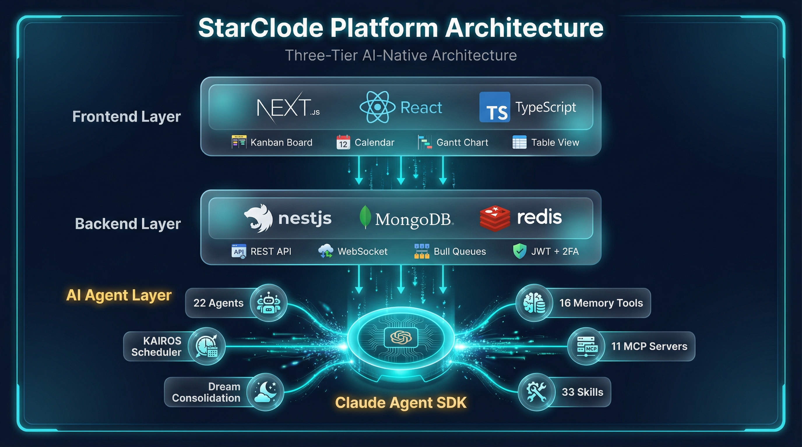
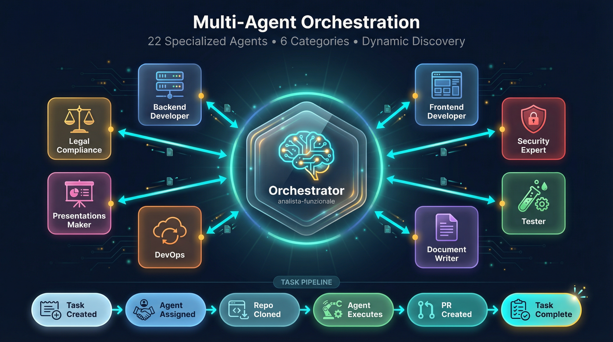
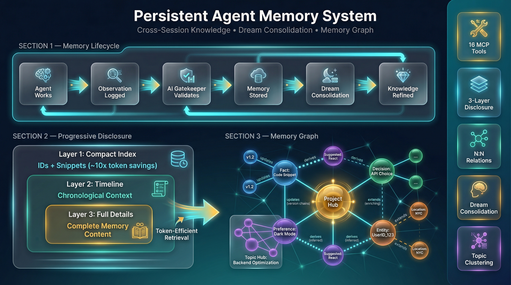
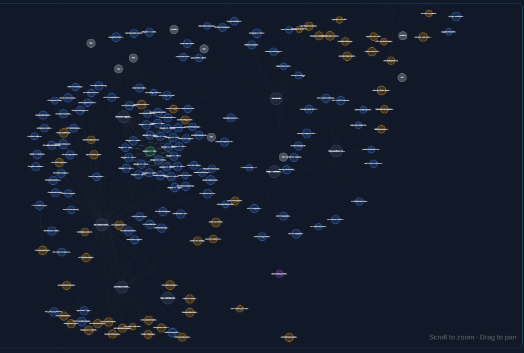
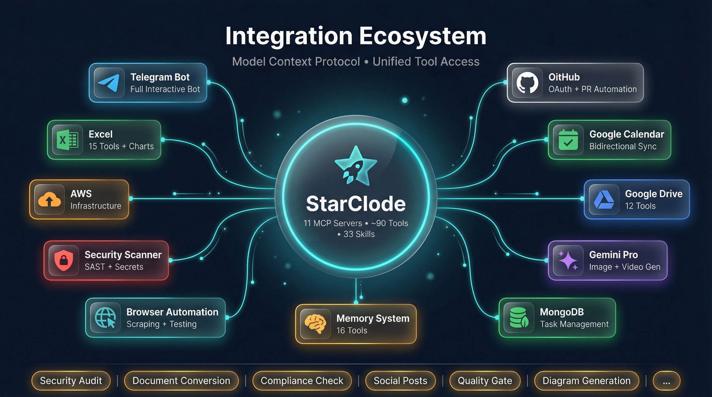
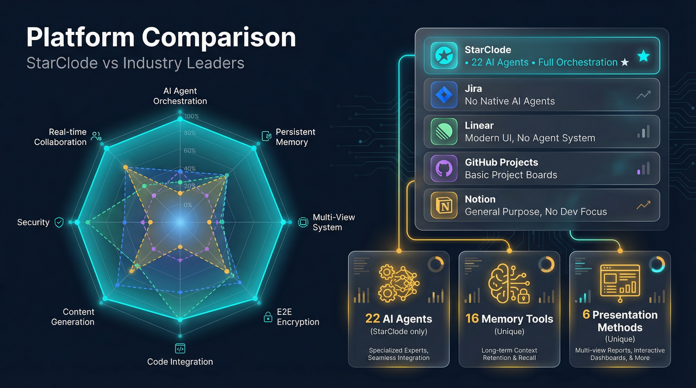

# StarClode: An AI-Native Project Management Platform with Multi-Agent Orchestration, Persistent Memory, and Self-Evolving Skills

> **Technical Paper — Version 1.62.0+**
>
> StarClode Engineering Team | April 2026 | Classification: Public

| | |
|---|---|
| **Version** | 1.62.0+ |
| **Date** | April 2026 |
| **Authors** | StarClode Engineering Team |
| **Classification** | Public |
| **Audience** | Investors, Technical Partners, Enterprise Evaluators |

---

## Table of Contents

| # | Section | Key Topics |
|---|---------|------------|
| 1 | [Abstract](#1-abstract) | Platform overview, four key innovations |
| 2 | [Introduction](#2-introduction) | Problem statement, market gap, approach |
| 3 | [Platform Architecture](#3-platform-architecture) | Three-tier design, session isolation |
| 4 | [Core Features](#4-core-features) | Task hierarchy, views, encryption, integrations |
| 5 | [AI Agent System](#5-ai-agent-system) | 20+ agents, orchestration, skills, KAIROS |
| 6 | [Agent Memory System](#6-agent-memory-system) | AI gatekeeper, dream consolidation, graph |
| 7 | [Content Creation Toolkit](#7-content-creation-toolkit) | PPTX, XLSX, DOCX, diagrams |
| 8 | [Security and Authentication](#8-security-and-authentication) | 2FA, E2E encryption, RBAC, scanner |
| 9 | [Integration Ecosystem](#9-integration-ecosystem) | 11+ MCP servers, 90+ tools, 30+ skills |
| 10 | [Comparison with Existing Platforms](#10-comparison-with-existing-platforms) | vs Jira, Linear, Claude CLI, Cursor, Devin |
| 11 | [Conclusion and Future Directions](#11-conclusion-and-future-directions) | Summary, roadmap |

---

## 1. Abstract

StarClode is an AI-native project management platform that fundamentally reimagines the relationship between development teams and artificial intelligence. Unlike conventional project management tools that treat AI as a supplementary chatbot or suggestion engine, StarClode embeds AI agents as first-class participants in the software development lifecycle. Specialized agents autonomously receive task assignments, clone repositories, write and test code, commit changes, open pull requests, and mark tasks complete — all without human intervention at the execution level.

At version 1.62.0 and beyond, the platform operates with a growing fleet of over 20 specialized agents organized into six functional categories, supported by approximately 90 tools distributed across 11 MCP (Model Context Protocol) servers and over 30 reusable skill definitions — with more being added continuously through an automated skill generation system. Four key innovations distinguish StarClode from the existing market: a multi-agent orchestration model in which a maestro orchestrator coordinates specialist sub-agents through structured handoff protocols; a persistent memory system with AI-powered dream consolidation that synthesizes accumulated knowledge across sessions; a prompt compression mechanism that reduces token consumption by approximately 60 percent on long-running agent continuations; and a self-evolving skill system that captures session workflows into reusable automation templates, enabling the platform to learn and expand its own capabilities over time. Together, these capabilities position StarClode as a platform where AI agents become productive members of a software team, not merely assistants.

---

## 2. Introduction

### 2.1 The Problem with Current AI Tooling

Software development teams face a growing tension. On one side, generative AI has demonstrated genuine ability to accelerate code authorship, documentation, and review. On the other side, the actual delivery of software requires far more than writing isolated code snippets. A task moves through ideation, planning, implementation across multiple files, testing, review, integration with existing branches, and deployment. Contemporary AI tools — whether IDE-integrated copilots or standalone chat interfaces — operate exclusively within the code-writing slice of this lifecycle. They require a developer to remain in the loop for every decision, translation from suggestion to action, and commit.

This fundamental dependency on human intermediation limits AI's practical impact. Studies of copilot-style tools consistently show that developers spend significant time reformulating AI suggestions, correcting context drift across long sessions, and manually orchestrating the sequence of subtasks that constitute real-world development work. The net productivity gain, while real, falls well short of what autonomous execution could deliver.

### 2.2 The Gap in Existing Project Management Platforms

Established project management platforms — Jira, Linear, GitHub Projects, Notion — were designed for human-to-human coordination. They excel at ticket tracking, status visualization, and team communication. None of them provide a model for AI agents to receive tasks, execute work autonomously, and report back through the same task lifecycle that the rest of the team uses. Adding AI to these platforms has primarily meant natural language search, automatic field suggestions, or summarization of existing content. The underlying workflow remains human-operated.

A smaller category of agentic coding tools — Devin, SWE-agent, and similar systems — takes the opposite approach, focusing entirely on autonomous coding with little integration into team project management. These tools lack sprint management, multi-view planning interfaces, team collaboration features, and the governance controls (role-based access, audit trails, encryption) that enterprise teams require.

### 2.3 StarClode's Approach

StarClode bridges this gap by building a complete project management platform in which the AI agent tier is designed with the same architectural depth as the human-facing tier. Every task in the system carries fields for agent assignment, agent status, linked branch, linked pull request, and execution logs. The same kanban board a product manager uses to review sprint progress shows real-time agent status updates as agents progress from planning to working to completed. Agents are not a plugin; they are co-equal participants in the workflow.

Version 1.62.0 of StarClode represents the platform's most comprehensive release to date, introducing the memory ingest tool for knowledge extraction from external documents and URLs, N:N memory relations for rich knowledge graph construction, topic clustering for semantic organization, and an interactive d3-force memory graph visualization. These advances bring the agent memory system to a level of sophistication that meaningfully differentiates StarClode from any existing project management or agentic development tool.

---

## 3. Platform Architecture

StarClode is built on a three-tier architecture that separates user-facing concerns, business logic and data management, and the AI execution layer into distinct, independently scalable components.

### 3.1 Frontend Layer

The frontend is a Next.js 14 application using the App Router pattern with React 18 and strict TypeScript throughout. Tailwind CSS provides the design system foundation, enabling rapid, consistent UI development. Zustand manages global client state across authentication, task boards, calendar, messaging, and agent monitoring views. SWR handles server-state synchronization with automatic revalidation and optimistic updates. The rich text editor, built on Tiptap v3, supports inline Mermaid diagrams, Draw.io visual diagrams, file attachments, and formatted comments with user mentions.

The frontend includes dedicated administrative views for managing agents, platform configuration, API usage, cron jobs, memory visualization, and team workspaces. A floating messenger widget persists across all dashboard pages, providing team communication without navigation interruption. The interface supports English and Italian, full dark mode, and a responsive layout designed for desktop-first use with touch interactions for tablet access.

### 3.2 Backend Layer

The backend is a NestJS 10 application — a TypeScript-first, module-oriented Node.js framework that provides dependency injection, guard-based authorization, pipe-based validation, and built-in support for Bull queues and scheduled jobs. Business logic is organized into approximately twenty domain modules covering authentication, tasks, sprints, projects, teams, agents, analytics, GitHub integration, Google Calendar, Telegram, messaging, and calendar events.

MongoDB Atlas serves as the primary data store, providing a flexible document schema well-suited to the evolving data model of an agent-augmented task system. Redis powers Bull queues for asynchronous agent job processing, decoupling task assignment from agent execution and enabling reliable retry behavior. Socket.io provides two WebSocket namespaces: one for real-time agent output streaming during execution, and one for live task status updates visible across all sprint views.

### 3.3 AI Execution Layer

The AI layer is built on the Claude Agent SDK from Anthropic, augmented by a custom multi-agent orchestration framework. The platform manages an extensible registry of specialized agent definitions — currently over 20 and growing — each with a dedicated system prompt, a set of registered triggers, a capability declaration, and handoff protocols for delegation. Adding a new agent is as simple as creating its definition file and registering it; the orchestrator discovers it automatically without code changes. The Agent Worker Service polls for queued tasks every five seconds, clones the associated repository into an isolated workspace, launches the appropriate agent with full task and project context, streams output in real time via WebSocket, and then handles the resulting commits, branch push, and pull request creation.

MCP (Model Context Protocol) servers extend agent capabilities beyond language model reasoning to concrete tool use: database queries, file operations, web browsing, Telegram messaging, Google Drive access, image and video generation, security scanning, and the persistent memory system. This tool layer is what enables agents to take real-world actions rather than producing text suggestions for humans to act upon. The MCP ecosystem is designed to be open-ended — new servers can be added and made available to all agents through centralized configuration, without per-agent reconfiguration.

### 3.4 Session Isolation Model

A key architectural property of the agent execution layer is session isolation. Every agent execution runs in a unique workspace directory identified by the session ID. Planning files, intermediate outputs, and agent context files are namespaced to that session. Agents operating concurrently cannot access each other's planning files, preventing interference between parallel executions. The analista-funzionale orchestrator creates a session-specific planning document as its first action, and all downstream agents validate the presence of their session-specific context before proceeding. This model enables safe concurrent execution of multiple agent sessions against the same repository without planning state collisions.

---

## 4. Core Features

### 4.1 Task Hierarchy Management

StarClode organizes work into a four-level hierarchy: Projects contain Sprints, Sprints contain Tasks, and Tasks contain Subtasks. This structure maps naturally to common agile practices while providing the granularity needed for agent-level work assignment. Projects carry GitHub repository links that agents use for branch management and pull request creation. Sprints are time-boxed iterations with start and end dates, enabling Gantt visualization and calendar synchronization. Tasks carry a rich attribute set: title, rich text description, priority, assignees, due date, file attachments, comments with mentions, linked GitHub branch and PR, and a full agent status lifecycle with associated audit trail.

### 4.2 Multi-View System

Tasks and sprints are visualizable across four complementary views. The Kanban board uses drag-and-drop column management to display tasks by status, with real-time agent status indicators embedded in each task card. The Table view provides a filterable, sortable grid suitable for bulk task management and reporting. The Calendar view integrates task due dates and project milestones with team calendar events, providing a unified scheduling interface. The Gantt chart renders project timelines with sprint boundaries and task dependencies, enabling portfolio-level progress monitoring.

### 4.3 Team Collaboration

Team collaboration is built around role-based membership across predefined organizational units. Team roles distinguish between editors, who have full read-write access to project content, and viewers, who receive notifications and read-only access. Invite links enable frictionless team onboarding without requiring admin intervention for each new member. The rich text comment system supports user mentions that trigger in-app and Telegram notifications. A presence system shows online teammates in real time. Full-page and floating messaging interfaces provide direct and team-channel communication.

### 4.4 End-to-End Encrypted Messaging

The messaging system, introduced in version 1.59.0, implements genuine end-to-end encryption using the NaCl cryptographic library. Key exchange uses X25519 Diffie-Hellman elliptic curve cryptography. Message encryption uses XSalsa20-Poly1305, a stream cipher with authentication. Encryption keys are derived from user passwords using PBKDF2 with the Web Crypto API, meaning the server never holds plaintext message content or recoverable keys. Keys are cached in IndexedDB for session performance but can be regenerated from the user's password on any device. Emoji reactions on messages are synchronized in real time via WebSocket with support for up to 20 reactions per message.

### 4.5 GitHub Integration

GitHub integration enables a direct link between task management and code delivery. Users connect their GitHub accounts via OAuth2. Repositories are linked to projects, and tasks generate dedicated branches following a consistent naming convention. Agents use this integration to push their work and create pull requests with auto-generated descriptions that reference the originating task. The platform supports bulk branch merging for sprint completion workflows, with a dedicated interface for reviewing and merging multiple open branches simultaneously. Task cards display current PR status and provide direct links to GitHub for review.

### 4.6 Google Calendar Synchronization

The Google Calendar integration provides bidirectional synchronization between platform events and personal or team calendars. Task due dates and calendar events created within the platform are pushed to connected Google Calendars. Google Calendar events are surfaced within the platform's calendar view, creating a unified scheduling interface. OAuth tokens for this integration are stored encrypted in MongoDB and are never transmitted in plaintext. Attendee status tracking for meetings and calls is maintained within the platform.

### 4.7 Telegram Bot System

The Telegram integration goes substantially beyond notification delivery. A full interactive bot, built on the Telegraf library, supports command handling, reply processing, and inline button callbacks. Users configure their Telegram chat ID in their profile settings to receive personalized notifications. The bot delivers deadline alerts at 24-hour, 3-hour, and 1-hour windows; notifies team channels on task status changes; and surfaces important activity feed updates. Chat sessions maintain state for multi-step interactions. The KAIROS autonomous scheduling system uses Telegram as its primary interface for presenting scheduled action proposals to users for approval or rejection.

---

## 5. AI Agent System

The AI agent system is StarClode's primary differentiating capability. It transforms the platform from a task tracker into an autonomous development environment where AI agents become accountable participants in software delivery.

### 5.1 The Extensible Agent Ecosystem

StarClode maintains a growing registry of specialized agents organized into six functional categories. The ecosystem is designed to scale — adding a new agent requires only a definition file and a registry entry, with no changes to the orchestrator or platform code. As of version 1.62.0, the platform fields over 20 agents, with more being added regularly.

**Development agents** form the technical execution core: the analista-funzionale orchestrator coordinates multi-agent workflows and maintains planning documents; the frontend developer specializes in Next.js, React, and TypeScript; the backend developer covers NestJS API design and database work; the DevOps agent handles Docker, CI/CD, and infrastructure; and the tester agent writes unit, integration, and end-to-end test suites.

**Specialist agents** address cross-cutting concerns: security analysis and vulnerability assessment; UI/UX design and optimization; technical documentation and format conversions; legal and regulatory compliance (GDPR, MiCAR, DORA); project initialization and stack detection; and more. This category grows most actively as teams onboard domain-specific expertise.

**Business agents** serve strategic and market needs: marketing strategy and campaign planning; platform-specific social media content creation; competitive analysis and market research.

**Automation agents** extend reach beyond the codebase: web scraping, screenshot capture, and browser-based workflow automation through headless browser control.

**Domain-specific agents** serve the deploying organization's specialized needs. Examples include AWS infrastructure management, blockchain and EVM smart contract architecture, platform-level ICT architecture, compliance operations, and EU regulatory compliance work. Organizations deploying StarClode can add their own domain agents without modifying the platform.

**Content creation agents** cover presentations (with six distinct creation approaches), workflow diagrams, infographics, and visual materials — with access to the full suite of content creation tools described in Section 7.

### 5.2 Agent Registry and Dynamic Discovery

All agents are defined in a centralized registry that serves as the authoritative source for capability discovery. Each agent entry declares the agent's name, role, trigger keywords, capability summary, and handoff protocols that describe which other agents it should delegate to for specialized subtasks. The analista-funzionale orchestrator reads this registry when planning multi-agent workflows, selecting downstream agents based on capability match to the subtask requirements. This dynamic discovery model means that adding a new agent to the registry immediately makes it available for orchestration without modifying the orchestrator's logic.

### 5.3 The Orchestration Model

The orchestration model centers on the analista-funzionale agent as maestro orchestrator. When a task is assigned to this agent, it reads the task description, analyzes the required work, produces a structured planning document, and then delegates subtasks to specialist agents through a defined handoff protocol. Handoffs carry a structured context package: the session ID, the planning document location, the specific subtask scope, and any relevant decisions made earlier in the session.

Specialist agents complete their assigned scope and report results back through the planning document. The orchestrator synthesizes results, validates completeness, and either delegates additional work or closes the session. This model supports both sequential workflows, where subtasks must complete in order, and parallel workflows, where independent subtasks can execute concurrently across separate agent sessions.

### 5.4 The Task-to-Agent Pipeline

The pipeline from task assignment to delivered pull request follows a defined sequence. A user assigns an agent to a task through the platform UI, setting the task's agent status to queued. The Agent Worker Service detects this state within its five-second polling interval and initiates execution. The worker resolves the linked GitHub repository, creates or uses an existing branch, clones the repository into a session-isolated workspace, writes the task context and session metadata to the workspace, and launches the agent.

The agent executes with access to the full task description, sprint context, company guidelines, platform rules, and its registered MCP tools. It reads the codebase, formulates a plan, implements changes, runs tests where available, commits its work with descriptive commit messages, and pushes the branch. The worker then creates a pull request on GitHub with an auto-generated description referencing the originating task. The task is updated with the PR URL, PR number, and a status of completed. The entire sequence produces a reviewable, mergeable pull request with no human involvement in the execution steps.

### 5.5 Prompt Compression

Long-running agent sessions accumulate substantial context across many tool calls and model interactions. Without mitigation, context windows fill with historical output that is valuable for continuity but expensive in token consumption. StarClode addresses this through prompt compression: when a session continuation exceeds a configurable length threshold, the platform uses Claude Haiku to produce a compressed summary of the accumulated context. This summary replaces the full historical output as the continuity signal for the next interaction. The result is approximately 60 percent reduction in token consumption on continued sessions, with preservation of the key decisions, findings, and state that the agent needs to continue effectively. This compression mechanism directly reduces API costs and extends the effective working window for complex, long-running tasks.

### 5.6 Agent Configuration Templates

Administrators and team leads can save agent configuration templates: reusable parameter sets that pre-configure an agent with specific context, constraints, and behavioral preferences for recurring task types. A template might configure the backend developer agent with a specific coding style guide, a particular test coverage requirement, and instructions to prioritize a specific architectural pattern. Templates are stored per project, selected at task assignment time, and applied automatically to the agent's execution context. This mechanism enables consistent agent behavior across a class of similar tasks without requiring each task description to re-establish baseline expectations.

### 5.7 Skill Auto-Generation and Self-Evolving Capabilities

One of StarClode's most forward-looking capabilities is its self-evolving skill system. Traditional platforms require developers to manually code new automation workflows. StarClode takes a fundamentally different approach: it can capture a successful session workflow and automatically generate a reusable skill definition from it.

The `/skillify` command analyzes the current session's conversation history, tool usage, and decision flow, then guides the user through a structured interview to refine the captured process into a formal SKILL.md specification. The generated skill includes YAML frontmatter (name, description, trigger phrases, required tool permissions, arguments), structured execution steps with success criteria and human checkpoints, and execution mode configuration (inline or forked context). Skills are saved to the project's `.claude/skills/` directory and become immediately available to all agents.

This means every complex workflow an agent successfully completes can become a one-command repeatable process. A team that develops a multi-step compliance review workflow, for example, can capture it as a skill that any agent can invoke with a single command in future sessions. The platform literally learns from its own work.

Additionally, the **Skills Auto-Discovery** service scans skill directories at runtime, detects new or modified skill definitions, and hot-reloads them into the agent's available command set without requiring a restart or redeployment. Skills can be conditionally activated based on file paths — a skill for React component patterns, for instance, activates only when the agent touches `.tsx` files.

The skill library currently includes over 30 definitions spanning memory management, document conversion, presentation creation, Excel reporting, security scanning, browser automation, social media publishing, and more — and this number grows organically as teams capture their workflows.

### 5.8 KAIROS: Autonomous Scheduling

KAIROS (the platform's dynamic cron job system) enables agents to operate on scheduled triggers rather than requiring manual task assignment. Administrators configure KAIROS rules that describe recurring workflows: launching an agent against every todo task in an active sprint at a scheduled time, running a utility agent for housekeeping operations, or triggering a custom agent workflow. KAIROS uses an LLM evaluator to assess proposed actions before scheduling them, Telegram as the approval interface for presenting proposed actions to responsible users, and a structured execution log for audit purposes. This mechanism brings autonomous operation to operational workflows, enabling sprint automation, recurring report generation, and scheduled maintenance without manual initiation.

---

## 6. Agent Memory System

The agent memory system is StarClode's second major differentiator. Software development generates knowledge that accumulates across sessions: architectural decisions, discovered constraints, preferred patterns, team conventions, integration quirks, and lessons learned from previous failures. Without a mechanism to persist and recall this knowledge, every new agent session starts from zero, re-discovering information that was previously worked out at cost. The StarClode memory system solves this problem.

### 6.1 System Overview

The memory system is exposed to agents through the memory-mongodb MCP server, which provides 16 tools organized in three functional groups. Storage uses MongoDB Atlas, the same cluster as the main application database, avoiding the operational complexity of a separate vector database. Retrieval uses MongoDB's weighted text index — a BM25-like scoring mechanism — providing high-quality relevance ranking without the cost and latency of vector embedding generation. All AI-powered operations within the memory system use Claude Haiku for cost efficiency.

### 6.2 The AI Gatekeeper

When an agent stores a memory, it does not simply write a record. The memory_store tool passes the candidate memory through an AI gatekeeper before persistence. The gatekeeper evaluates three criteria: whether the information is genuinely worth retaining across sessions (filtering out ephemeral or task-specific details that would not be reusable), what project scope the memory belongs to (validating the project_id for correct isolation), and what keywords and category best describe the memory for retrieval. It then checks the existing memory store for near-duplicate content, merging or linking rather than duplicating when a strong overlap is detected. Only memories that pass this validation chain are written to MongoDB. The result is a curated knowledge base rather than an undifferentiated log of everything an agent encountered.

### 6.3 Progressive Disclosure Architecture

The 16 memory tools are organized into a three-layer progressive disclosure architecture that manages token consumption during recall operations. Layer one, memory_search_index, returns a compact index of matching memories — just identifiers, titles, and relevance scores — consuming minimal tokens. An agent can scan dozens of candidate memories to identify the most relevant. Layer two, memory_timeline, returns a chronological view of selected memories with moderate detail, sufficient to assess relevance and recency. Layer three, memory_get_details, returns the full content of specific memories selected from prior layers. An agent that needs to recall knowledge moves through these layers only as far as the task requires, rather than loading full memory content for every search. This architecture reduces typical recall token consumption by approximately an order of magnitude compared to loading full records from the first query.

### 6.4 Dream Consolidation

Dream consolidation is a nightly LLM-powered knowledge synthesis process that runs against each project's memory store. Inspired by the neuroscientific hypothesis that memory consolidation occurs during sleep, this process identifies and resolves inefficiencies that accumulate in actively used memory stores.

The consolidation pipeline operates in three phases. The merge phase identifies clusters of memories that cover the same subject matter, consolidates them into a single authoritative record, and creates version links from the consolidated memories to the new canonical version. The archive phase identifies memories that have become stale — no longer relevant given more recent knowledge — and soft-deletes them with a reason annotation, preserving them for historical reference without cluttering active recall results.

The relationship discovery phase, introduced in version 1.62.0, adds a third capability. It applies Jaccard keyword similarity to pre-filter candidate memory pairs that might be semantically related, then uses LLM classification with a confidence threshold of 0.80 to determine whether a genuine relationship exists and what type it is. Discovered relationships are written to the N:N relations structure described below. This phase is idempotent — pairs that already have an explicit relationship are skipped — so repeated consolidation runs accumulate knowledge without creating duplicate links.

### 6.5 N:N Memory Relations

Version 1.62.0 introduces many-to-many memory relationships, replacing the earlier one-to-one relation model. Each memory can now carry multiple outgoing relations to other memories, with each relation typed as one of three semantic categories: updates (a memory supersedes or corrects another), extends (a memory adds to or elaborates on another), or derives (a memory was logically derived from another). These typed relations form a knowledge graph that agents can traverse during recall to follow chains of reasoning, find the most current version of a known fact, or understand the intellectual lineage of a design decision. Relationship creation can occur through agent tool calls during active sessions, through the dream consolidation relationship discovery process, or through the memory ingest pipeline.

### 6.6 Memory Ingest

The memory_ingest tool enables bulk knowledge extraction from external sources. An agent can provide a URL (HTTP or HTTPS) or a local file path (supporting text, Markdown, CSV, JSON, PDF, and DOCX formats), and the tool extracts structured, reusable memories from that content. The pipeline fetches or reads the source material, chunks it into segments of approximately 1,800 tokens to fit within model context, submits each chunk to Claude Haiku for memory extraction (yielding zero to five memories per chunk), scans for credentials or sensitive data that should not be persisted, deduplicates against existing memories using content hashing, and inserts the resulting records into MongoDB with full source provenance tracking. This enables a team to ingest an architecture decision record, a technical specification, or an existing documentation site and make its knowledge immediately available to all future agent sessions.

### 6.7 Topic Clustering

The topic clustering capability organizes project memories into semantic groups through LLM-powered classification. A generation process analyzes all memories for a given project and produces five to fifteen topic labels with associated memory assignments. Topics represent the major knowledge domains the project's memory store covers — for example, "authentication patterns," "API design conventions," "database indexing strategy," or "third-party integration quirks." These topic groups are visualized as hub nodes in the memory graph and serve as navigational aids during recall, allowing agents to identify which knowledge domain is relevant to their current task before executing granular searches.

### 6.8 Memory Graph Visualization

The memory graph, accessible from the platform's administrative interface, renders the memory knowledge base as an interactive force-directed graph using D3's physics simulation on HTML5 Canvas. The following screenshot shows a real production memory graph from an active StarClode project:

Nodes represent individual memories, colored by category (blue for facts, amber/orange for decisions, gray for entities), with visual distinctions for the latest version of a memory chain (glow ring), soft-deleted memories (dashed stroke), and versioned memories (version number badge). Hub nodes for projects, categories, and semantic topics appear as differently styled node types with starburst-orbit force configurations that cluster associated memories around them. Edges are styled by relation type: updates use solid gray lines, extends use dashed lines, derives use thick blue lines. Users can pan by dragging empty space, zoom with scroll, reposition nodes by dragging, and hover over nodes for a tooltip showing memory details. The visualization scales to hundreds of nodes with thousands of relationships, providing a navigable overview of the accumulated project knowledge structure. The screenshot above demonstrates a real knowledge network with dense interconnections between memory clusters — the result of weeks of agent activity accumulating institutional knowledge.

---

## 7. Content Creation Toolkit

StarClode provides a comprehensive content creation toolkit that agents use to produce professional-quality documents, presentations, spreadsheets, and diagrams as deliverables from their task execution.

### 7.1 Presentation System

The presentation system supports six distinct creation approaches to cover the full range of presentation requirements. The recommended approach, html2pptx, converts pixel-perfect HTML layouts to PPTX using a headless browser for rendering combined with a JavaScript-based PPTX generation library — achieving near-perfect fidelity between HTML design and slide output. A template-based workflow supports brand-consistent decks by extracting text inventory from existing PPTX templates and performing structured text replacement. A JSON-to-PPTX approach enables rapid generation of structured decks from a data specification using nine predefined slide layouts. The Gemini AI approach generates slide images using Google's image generation API and assembles them into a PPTX file. HTML presentations using Reveal.js produce self-contained HTML files suitable for web-based delivery. Pandoc provides a rapid Markdown-to-PPTX path for content-heavy, formatting-light presentations. A ten-subcommand PPTX editor enables programmatic modification of existing decks, and an OOXML editing path supports raw XML manipulation for scenarios requiring complete slide control.

### 7.2 Excel and XLSX System

The Excel system is organized into three layers that give agents flexible access to spreadsheet creation and modification capabilities. The first layer is an MCP server providing 15 dedicated tools covering workbook creation, sheet management, data reading and writing, cell formatting, column width and row height control, cell merging, freeze panes, chart creation, conditional formatting, data validation, workbook validation, and multi-file merging. The second layer is a set of eight Python CLI scripts implementing the same capabilities in a composable command-line form. The third layer is an agent skill definition providing strategic guidance on when to use which approach and how to combine capabilities for complex reporting workflows. The system supports seven chart types, color scale and data bar conditional formatting, dropdown and range-based data validation, and template-based report generation from placeholder-filled XLSX files.

### 7.3 DOCX Revision System

The DOCX revision MCP server provides seven tools for professional document co-authoring workflows. The system can inspect a DOCX file for tracked change and comment counts by author, extract content in four modes (final text, original text, annotated view with inline change markers, and full metadata), inject agent-authored edits back into the document as native Word tracked changes, accept or reject tracked changes selectively by author, and add or delete comments. This combination of capabilities allows an agent to participate as a genuine co-author in a Word-based editorial workflow: receiving a document with existing tracked changes, making its own changes in the same tracked format, and returning a document that a human reviewer can accept, reject, or further modify in Microsoft Word without any format conversion.

### 7.4 Diagram System

The rich text editor supports inline diagram creation through two integrated tools. Mermaid.js enables code-based diagram authoring using a lightweight markdown-like syntax for flowcharts, sequence diagrams, entity-relationship diagrams, class diagrams, state machines, Gantt charts, pie charts, and mind maps. Draw.io provides a visual drag-and-drop diagram editor accessible through an embedded popup, producing diagrams stored as structured XML with a PNG preview embedded in the document. Agents have dedicated skills for both tools, enabling them to generate architectural diagrams, workflow illustrations, and data model visualizations as part of their task deliverables.

---

## 8. Security and Authentication

StarClode takes a security-first approach across authentication, data storage, communications, and operational tooling.

### 8.1 Authentication Model

Authentication is built on stateless JWT tokens with short-lived access tokens (15-minute expiry) and longer-lived refresh tokens (7-day expiry). Mandatory two-factor authentication using TOTP (Time-based One-Time Passwords, RFC 6238) is enforced at first login for every user — it cannot be bypassed or deferred. TOTP secrets are generated with the speakeasy library, delivered to users via QR code, and stored encrypted in MongoDB. Backup codes are generated at enrollment and can be regenerated by the user at any time. Bcrypt with 12 or more rounds is used for password hashing. The platform supports admin-initiated bulk session invalidation for security incident response.

### 8.2 Encryption at Rest

Sensitive values stored in the database — OAuth access tokens for GitHub and Google Calendar, two-factor authentication secrets, and the platform's Anthropic API key — are encrypted using AES-256-GCM before storage. The encryption key is stored as an environment variable and never enters the database. This means a database credential leak does not directly expose OAuth tokens or 2FA secrets.

### 8.3 End-to-End Encrypted Messaging

As described in Section 4.4, the messaging system implements genuine end-to-end encryption. The server stores only ciphertext. The encryption design ensures that even a complete server compromise does not yield readable message history, because the plaintext keys exist only in users' browsers, derived from their passwords using PBKDF2. Per-user salts are stored server-side to prevent rainbow table attacks on the key derivation. X25519 key exchange provides forward secrecy properties for the shared secrets used in team channel encryption.

### 8.4 Access Control

Role-based access control operates at two levels. At the platform level, Admin and User roles distinguish between users who can manage platform configuration, agent settings, and all teams, and users who can manage only their own profile and assigned work. At the team level, Editor and Viewer roles control write access to tasks, sprints, and project content. Ten-plus guards implement these controls at the request level, including guards for team role validation, project membership, resource ownership, task deletion authorization, and calendar event ownership.

### 8.5 Transport and Application Security

The NestJS application configures Helmet security headers, strict CORS with a single-origin allowlist, and rate limiting on authentication endpoints using the NestJS throttler. Input validation is applied globally through NestJS's ValidationPipe using class-validator rules on all incoming DTOs. Rich text content from user input is sanitized with DOMPurify before storage and rendering, with a custom sanitization function that whitelists diagram data attributes while removing all potentially dangerous HTML. WebSocket connections require valid JWT tokens on the handshake.

### 8.6 Security Scanner MCP

The security scanner MCP server provides agents with integrated security analysis capabilities. Six tools cover static analysis of individual files, recursive directory scanning, npm dependency auditing for known CVEs, secrets detection that scans for hardcoded API keys, tokens, passwords, and connection strings (including optionally scanning git history), a combined full-scan mode, and a configuration management tool for adjusting scanner sensitivity. Security expert agents use these tools as part of security review tasks, and tester agents can incorporate security scanning into testing workflows.

---

## 9. Integration Ecosystem

StarClode's integration ecosystem is built on the Model Context Protocol, an open standard for providing AI agents with structured access to external tools and data sources.

### 9.1 MCP Server Architecture

The platform operates eleven MCP servers providing approximately 90 tools in aggregate. MCP servers are configured centrally and made available to all agents through the platform's settings, meaning individual agents do not require per-session configuration to access the full tool ecosystem. The MCP protocol provides a standardized invocation interface: agents call tools by name with structured parameters and receive structured responses, enabling consistent behavior across tools from different servers.

### 9.2 Communication and Messaging

The Telegram MCP server provides agents with direct access to Telegram messaging capabilities: sending messages to users or groups, delivering structured action proposals through the KAIROS workflow, and tracking message delivery. This enables agents to communicate status updates, request human approval for consequential actions, and escalate issues to responsible team members without leaving the platform workflow.

### 9.3 Memory and Knowledge

The memory-mongodb MCP server, described in full in Section 6, provides 16 tools for persistent knowledge management. This server is the most heavily used MCP integration in the platform, invoked at the start and end of every agent session through lifecycle hooks that automatically record session observations and synthesize session summaries.

### 9.4 Database Access

The mongodb MCP server provides direct query access to the platform's MongoDB database, enabling agents to inspect task data, sprint state, team membership, and project configuration as part of complex analytical or operational workflows. This access is constrained to read operations for most agent types, with write access limited to administrative agents.

### 9.5 Content Generation

The Gemini Pro MCP server connects agents to Google's Gemini AI models for media generation. Supported capabilities include image generation at up to 4K resolution suitable for infographics, presentation slides, and marketing materials; video generation of four to eight second clips at up to 4K; multi-turn conversational image editing; and text-to-speech synthesis across 30 voices. These capabilities enable content creation agents to produce rich visual materials as part of their task deliverables.

### 9.6 Document Management

The Google Drive MCP server provides twelve tools for file management on Google Drive and Shared Drives, supporting both Service Account and OAuth2 authentication. Files in Google Workspace formats are automatically exported to standard formats on read: Google Docs to Markdown, Sheets to CSV, Presentations to plain text, and Drawings to PNG. The DOCX revision MCP server, described in Section 7.3, provides seven tools for professional Word document co-authoring.

### 9.7 Browser Automation

The browser automation MCP server gives agents the ability to control a headless web browser: navigating to URLs, capturing screenshots, extracting structured data from web pages, filling forms, and clicking interactive elements. Browser automation agents use this capability for web research, competitive analysis, screenshot documentation, and automated interaction with web-based tools that lack API access.

### 9.8 Security and Infrastructure

The security scanner MCP server (Section 8.6) and AWS MCP server round out the infrastructure tier. The AWS MCP server provides agents with access to AWS service management, enabling infrastructure-focused agents to provision and configure cloud resources, manage deployments, and interact with AWS services as part of DevOps task execution.

### 9.9 Skills System

Complementing the MCP tool ecosystem, the platform maintains a growing library of over 30 reusable skill definitions — structured guidance documents that agents load to acquire specialized knowledge for particular task types. Skills cover topics including memory management protocols, document conversion workflows, presentation creation strategies, XLSX report generation, DOCX co-authoring, Mermaid and Draw.io diagram creation, security scanning procedures, browser automation, social media publishing, Slack and Discord messaging, GitHub operations, Trello and project management, Obsidian note integration, Spotify playback, weather data retrieval, context loading, state management, and agent handoff protocols. Skills enable capability transfer to agents without requiring those capabilities to be hardcoded in agent system prompts.

Crucially, skills are not static. The `/skillify` auto-generation command (Section 5.7) enables any successful agent workflow to be captured as a new skill, meaning the skill library grows organically as teams use the platform. Skills are loaded from multiple sources in priority order — managed (admin-level), user-personal, and project-scoped — with a file watcher that hot-reloads modified skill definitions in real time. Conditional activation ensures that domain-specific skills (e.g., React component patterns) activate only when relevant files are being edited, keeping the agent's active skill set lean and contextually appropriate.

---

## 10. Comparison with Existing Platforms

The project management and AI development tool landscapes provide useful benchmarks for contextualizing StarClode's capabilities and positioning.

### 10.1 StarClode vs. Jira

Jira is the dominant enterprise project management platform, offering a mature feature set for ticket tracking, sprint management, reporting, and integrations. It has no native AI agent execution capability. Atlassian Intelligence provides natural language assistance for content generation and search within Jira, but no mechanism exists for an AI agent to receive a Jira ticket, execute the associated development work autonomously, and update the ticket with results. StarClode delivers this end-to-end autonomous task execution as a core platform capability, not an add-on. StarClode's interface is also substantially simpler and faster to navigate for small-to-medium teams, trading Jira's extensive configuration surface for a more focused, opinionated workflow.

### 10.2 StarClode vs. Linear

Linear is the leading modern alternative to Jira, known for its fast, keyboard-navigable interface and opinionated issue structure. Linear has invested in AI for issue creation, summarization, and triage suggestions. Like Jira, it has no model for AI agents to autonomously execute work and report back through the task lifecycle. StarClode and Linear are similar in their target audience and interface philosophy, but StarClode adds the full multi-agent orchestration layer that Linear does not attempt to provide.

### 10.3 StarClode vs. GitHub Projects

GitHub Projects provides lightweight project management tightly integrated with the GitHub repository and issues ecosystem. Its AI capabilities are limited to Copilot-based code suggestions within GitHub's code editing surfaces. GitHub Projects lacks sprint management, multi-view planning interfaces, integrated team communication, Google Calendar sync, and any form of autonomous agent execution. StarClode complements GitHub at the project management layer, using GitHub's repositories and pull request infrastructure as the delivery mechanism while providing a richer planning and execution environment above it.

### 10.4 StarClode vs. Notion

Notion is a flexible workspace platform used for documentation, project management, databases, and collaborative note-taking. Notion AI provides content generation, summarization, and Q&A within Notion pages. Notion's generality is both its strength and its limitation for software development workflows: it lacks sprint management, native GitHub integration, automated PR creation, and agent-based task execution. StarClode is purpose-built for software development team workflows and provides deeper capability in that domain without attempting to be a general-purpose knowledge workspace.

### 10.5 StarClode vs. Agentic Coding Tools (Devin, SWE-agent)

Autonomous coding tools like Devin and SWE-agent focus on the task execution layer: given a problem description, an AI agent writes code to solve it. These tools demonstrate the potential of autonomous software development but operate without the project management context, team collaboration features, or governance controls that enterprise teams require. There is no sprint board, no role-based access, no GitHub integration for team-oriented PR workflows, no persistent memory across task assignments, and no integration with organizational communication systems. StarClode bridges the gap between the team coordination capabilities of project management platforms and the autonomous execution capabilities of agentic coding tools.

### 10.6 StarClode vs. AI-Powered CLI Tools (Claude Code CLI, Gemini Code Assist, GPT-based Tools)

A rapidly growing category of AI development tools operates as command-line interfaces or IDE extensions: Anthropic's Claude Code CLI, Google's Gemini Code Assist (and Gemini Pro), OpenAI's ChatGPT/Codex-based tools, and Cursor. These tools provide powerful single-session AI assistance for code generation, debugging, and file editing. However, they differ from StarClode in several fundamental ways.

**Single-session context.** CLI tools operate within a single terminal session or IDE window. When the session ends, all context is lost. StarClode's persistent memory system ensures that knowledge accumulates across sessions, projects, and team members.

**No project management.** CLI tools have no concept of sprints, tasks, team roles, or workflow status. A developer using Claude Code CLI must separately manage their work items in Jira, Linear, or another tracker. StarClode unifies the project management and AI execution layers.

**Single-agent model.** CLI tools typically operate a single general-purpose agent. StarClode fields a growing ecosystem of over 20 specialized agents, each with domain expertise, and an orchestrator that decomposes complex tasks across multiple specialists working in coordination.

**No team collaboration.** CLI tools are single-user by design. StarClode provides team messaging, role-based access control, real-time notifications, and shared visibility into AI agent progress across the entire team.

**No self-evolving capabilities.** CLI tools have a fixed set of capabilities per release. StarClode's skill auto-generation system means the platform can capture and reuse successful workflows, growing its capability set organically through use.

That said, StarClode acknowledges the excellence of these tools in their focused domains. Claude Code CLI's tool-use architecture and Gemini's multimodal capabilities are industry-leading. StarClode incorporates models from these providers (Claude as the primary agent model, Gemini for image and video generation) and treats them as complementary technology rather than direct competition.

### 10.7 Summary Comparison

| Capability | StarClode | Jira | Linear | GitHub Projects | Claude Code CLI | Cursor / Copilot | Devin |
|---|---|---|---|---|---|---|---|
| Sprint Management | Full | Full | Full | Basic | None | None | None |
| Multi-View (Kanban/Table/Calendar/Gantt) | All four | All four | Three | Two | None | None | None |
| AI Agent Task Execution | Native, 20+ agents | None | None | None | Single agent | Single agent | Single agent |
| Multi-Agent Orchestration | Yes, with handoffs | No | No | No | No | No | No |
| Persistent Agent Memory | Cross-session, AI-gated | No | No | No | Session only | Session only | Limited |
| Dream Consolidation | Yes | No | No | No | No | No | No |
| Skill Auto-Generation | Yes (/skillify) | No | No | No | No | No | No |
| E2E Encrypted Messaging | Yes | No | No | No | N/A | N/A | No |
| GitHub PR Automation | Native | Plugin | Plugin | Native | Manual | Manual | Partial |
| MCP Tool Ecosystem | 90+ tools, 11+ servers | No | No | No | Via MCP | Limited | Limited |
| Content Creation Toolkit | Full (PPTX/XLSX/DOCX) | No | No | No | Via prompting | Via prompting | No |
| Team Collaboration | Full | Full | Full | Partial | None | None | None |
| Self-Evolving Platform | Yes (skill capture) | No | No | No | No | No | No |

---

## 11. Conclusion and Future Directions

### 11.1 Summary of Key Innovations

StarClode version 1.62.0 represents a coherent answer to a clear market gap: software development teams need a project management platform where AI agents are genuine participants in the work, not assistants that suggest actions for humans to execute. The platform achieves this through four innovations that, taken together, are unique in the current market.

The multi-agent orchestration model — with a maestro orchestrator coordinating a growing ecosystem of over 20 specialized agents through structured handoff protocols, session-isolated execution workspaces, and a task-to-PR pipeline that requires no human intervention between assignment and deliverable — provides a practical, production-ready framework for autonomous software development at team scale.

The persistent memory system — with its AI gatekeeper, progressive disclosure architecture, dream consolidation knowledge synthesis, N:N relational knowledge graph, topic clustering, and memory ingest capability — gives agents the institutional memory that transforms isolated task execution into cumulative organizational capability. The longer StarClode operates within a project, the more contextually informed its agents become.

The self-evolving skill system — with automatic workflow capture via `/skillify`, hot-reloading skill definitions, conditional path-based activation, and a growing library of over 30 reusable skills — means the platform does not merely execute work but learns from it. Every successful complex workflow becomes a one-command repeatable process for future sessions, making the platform progressively more capable through use.

Prompt compression, at approximately 60 percent token reduction on continued sessions, makes long-running complex tasks economically viable by controlling the cost of the AI API consumption that underpins autonomous agent execution.

### 11.2 Future Directions

Several development directions are actively planned for future releases.

**Enterprise features** will expand the governance and compliance surface: audit log export, single sign-on (SAML/OIDC) integration, enterprise-grade RBAC with custom role definitions, and SLA monitoring for agent task execution times.

**Mobile applications** will extend the platform to native iOS and Android, focusing on task management, notification handling, and agent session monitoring for team leads and product managers who need visibility while away from a desktop context.

**Agent marketplace** will allow the community and enterprise customers to contribute specialized agent definitions, skill packages, and MCP server integrations. A curated marketplace would enable teams to extend the platform's capabilities for domain-specific workflows — medical software compliance, financial services regulation, embedded systems development — without requiring custom platform development.

**Public API** will expose platform capabilities to external integrations, enabling StarClode to serve as the AI execution backend for teams using other project management frontends or custom internal tooling.

**Memory federation** will enable knowledge sharing across projects within an organization, allowing agents working on related systems to access a curated subset of memories from peer projects, accelerating the transfer of architectural knowledge and learned conventions across team boundaries.

StarClode's trajectory is toward a platform where the boundary between human and AI contribution to a software project becomes genuinely fluid: where tasks route to the most capable available resource — human or agent — based on task type, current workload, and demonstrated capability, and where the platform's accumulated memory ensures that every participant, human and AI alike, operates with the full context of the project's history.

---

---

  <strong>StarClode Technical Paper v1.62.0+ — April 2026</strong> 
  <em>For partnership inquiries, enterprise licensing, or technical demonstrations, contact the StarClode team.</em>

